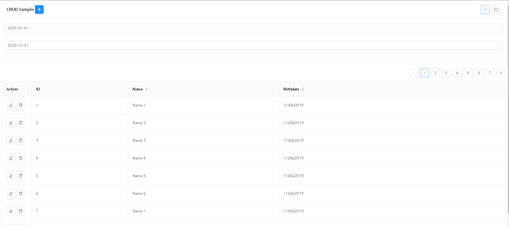
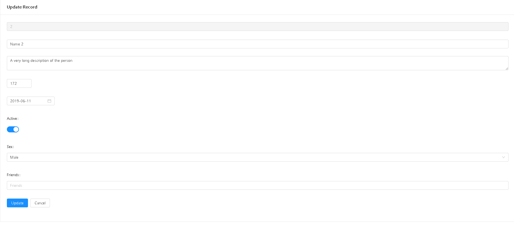

# React-Ant-Crud

This is a simple React Crud component using Ant Design as the UI Framework

Reduce boilerplate code. Hopefully it will be able to meet your use case...

Its VueJS cousin is at https://github.com/ais-one/vue-ant-crud


[](./screenshot0.png)

Features
 - page
 - filter
 - sort
 - configure form inputs based on data type
 - crud

[](./screenshot1.png)

## Must Do

Install the packages

```
npm i
```

## Try Out Example

```
npm run start
```

## Using It In Your Own Project

1. Installing it
```
npm i react-ant-crud
```

Refer to sample.js, for a more or less complete example of usage...

2. Using it (App.js)

```
import React from 'react'

// IMPORT THE LIBRARY
import ReactAntCrud from 'react-ant-crud'
// IMPORT YOUR CONFIGURATION
import * as sample from './sample'

import './App.css'

function App() {
  return (
    <div className="App">
      <ReactAntCrud {...sample} />
    </div>
  )
}

export default App

```

## Configuration

Refer to the sample.js Config File

1. constants

2. oprations - find, findOne, update, insert, remove

3. form fields

Supported Ant Design Form Inputs
- Input
- Input.TextArea
- Input Number
- Select (single, multiple)
- DatePicker
- TimePicker
- Switch
- File Upload (work in progress)
- Tree (under consideration)
- Transfer (under consideration)
- Slider (under consideration)

Notes:
  The following properties of Form Inputs are used by this library
  - value
  - onChange
  For other properties
  - should be ok to use, but be careful if it is a function
  - be careful of event functions, may not work via the config file

4. table columns


## Building The Source

```
npm run build
```


## Test Package Locally

```
npm pack

# before running next comment
# 1. make sure version matches
# 2. make sure you change the "name" property in package.json, and change it back after you fininsh with the command below
npm i --no-save react-ant-crud-0.1.0.tgz
```

## Notes

How to make your own React Component and publish on NPM

https://medium.com/recraftrelic/building-a-react-component-as-a-npm-module-18308d4ccde9


---

This project was bootstrapped with [Create React App](https://github.com/facebook/create-react-app).

## Available Scripts

In the project directory, you can run:

### `npm start`

Runs the app in the development mode.<br>
Open [http://localhost:3000](http://localhost:3000) to view it in the browser.

The page will reload if you make edits.<br>
You will also see any lint errors in the console.

### `npm test`

Launches the test runner in the interactive watch mode.<br>
See the section about [running tests](https://facebook.github.io/create-react-app/docs/running-tests) for more information.

### `npm run build`

Builds the app for production to the `build` folder.<br>
It correctly bundles React in production mode and optimizes the build for the best performance.

The build is minified and the filenames include the hashes.<br>
Your app is ready to be deployed!

See the section about [deployment](https://facebook.github.io/create-react-app/docs/deployment) for more information.

### `npm run eject`

**Note: this is a one-way operation. Once you `eject`, you can’t go back!**

If you aren’t satisfied with the build tool and configuration choices, you can `eject` at any time. This command will remove the single build dependency from your project.

Instead, it will copy all the configuration files and the transitive dependencies (Webpack, Babel, ESLint, etc) right into your project so you have full control over them. All of the commands except `eject` will still work, but they will point to the copied scripts so you can tweak them. At this point you’re on your own.

You don’t have to ever use `eject`. The curated feature set is suitable for small and middle deployments, and you shouldn’t feel obligated to use this feature. However we understand that this tool wouldn’t be useful if you couldn’t customize it when you are ready for it.

## Learn More

You can learn more in the [Create React App documentation](https://facebook.github.io/create-react-app/docs/getting-started).

To learn React, check out the [React documentation](https://reactjs.org/).

### Code Splitting

This section has moved here: https://facebook.github.io/create-react-app/docs/code-splitting

### Analyzing the Bundle Size

This section has moved here: https://facebook.github.io/create-react-app/docs/analyzing-the-bundle-size

### Making a Progressive Web App

This section has moved here: https://facebook.github.io/create-react-app/docs/making-a-progressive-web-app

### Advanced Configuration

This section has moved here: https://facebook.github.io/create-react-app/docs/advanced-configuration

### Deployment

This section has moved here: https://facebook.github.io/create-react-app/docs/deployment

### `npm run build` fails to minify

This section has moved here: https://facebook.github.io/create-react-app/docs/troubleshooting#npm-run-build-fails-to-minify
